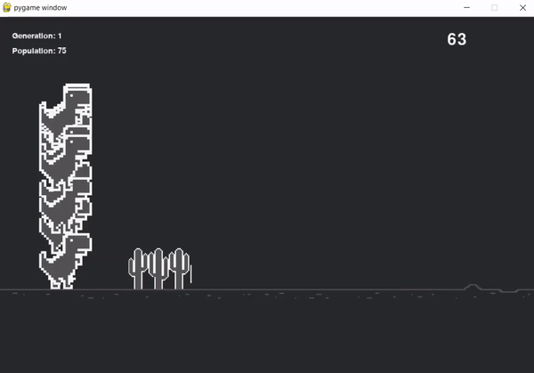
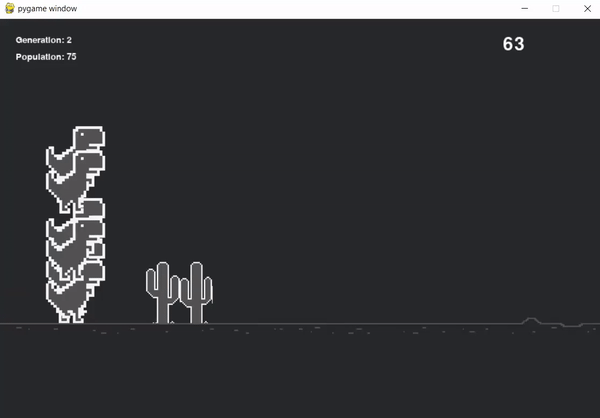
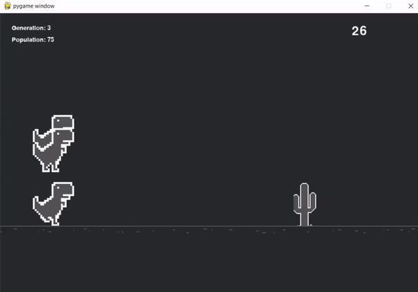

# AI learns to play Chome Dinosaur Game
An A.I which uses the [NEAT (Neuroevolution of Augmenting Topologies) Python module](https://neat-python.readthedocs.io/en/latest/neat_overview.html) to
play a cloned version of the Chrome Dinosaur Game

From our neural network (other hyperparameters specified in the _config.txt_ file):

```
# network parameters
num_hidden              = 0
num_inputs              = 2
num_outputs             = 1
```

- We use the the y-coordinate of the dinosaur & the distance between the dinosaur and the cacti as our two inputs to the neural network
- We use the output value of our neural network to determine whether the dinosaur jumps

After each generation of dinosaur, our dinosaur gets better and better and eventually learns how to play


## Demo of program

#### Generation one



#### Generation two




#### Generation three



## Imports
- Neat
- Pygame
